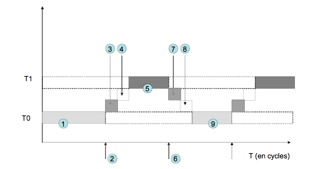

# Compte-rendu TP10

## Notes

TTY     -> 16 (1/tache)
DMA     -> 4  (1 CANAL / processeur)
TIMER   -> 4  (1 ? /processeur)
IOC     -> 1  (1 pour tous)

## B - Architecture matérielle

### B1
On connecte les signaux qui ne sont pas utilisés au signal *signal_irq_false*.
>
    // IOC
    icu.p_irq_in[0] = signal_irq_ioc;
    // in : unused
    for (int x = 1; x < 8; x += 1) {
        icu.p_irq_in[x] = signal_irq_false;
    }
    // in : TIMER & DMA
    for (int p = 0; p < 4; p += 1) {
        if (p < nprocs) {
            icu.p_irq_in[8 + p] = signal_irq_dma[p];
            icu.p_irq_in[12 + p] = signal_irq_tim[p];
        }
        else {
            icu.p_irq_in[8 + p] = signal_irq_false;
            icu.p_irq_in[12 + p] = signal_irq_false;
        }
    }
    // in : TTY
    for (int p = 0; p < 4; p += 1) {
        for (int t = 0; t < 4; t += 1) {
            if ((p < nprocs) and (t < 4)) {
                icu.p_irq_in[16 + p * 4 + t] = signal_irq_tty_get[p * 4 + t];
            }
            else {
                icu.p_irq_in[16 + p * 4 + t] = signal_irq_false;
            }
        }
    }
    // out : procs
    for (int p = 0; p < nprocs; p += 1) {
        icu.p_irq_out[p] = signal_irq_proc[p];
    }

## C - Contexte d'exécution d'une tâche

### C1
Le principe du pseudo-parallélisme par multiplexage temporel sur un processeur consiste à envoyer une interruption à intervalle de temps régulier pour signaler un changement de tâches dans le processur.\
Lors du changement de tâche, on sauvegarde le contexte de l'ancienne et on charge le contexte de la nouvelle tâche élue.

1) Éxecution de la tache T0.
2) Interruption du Timer pour interrompre la tâche T0.
3) La fonction *_isr_switch* (*irq_handler.c*) est exécutée. Elle appelle la fonction *_ctx_switch* (*ctx_handler.c*) qui va appeler *_task_switch* (*giet.s*). Elle va sauvegarder le contexte de l'ancienne tâche, choisir une nouvelle tâche en incrémentant l'index de tâche et charger le contexte de la nouvelle tâche.
4) Sortie de la fonction *_task_switch*, *ctx_handler* puis de *_isr_switch*.
5) Éxecution de la tache T1.

### C2
Le contexte d'une tâche est sauvegardé dans la variable globale *_task_context_array* qui contient tous les contextes de toutes les tâches qui on étés enregistrés.\
On ne sauvegarde pas directement les valeurs stockées dans la pile lors d'un changement de contexte mais l'adresse du pointeur de pile, qui permettra de retrouver les valeurs qui sont écrites dessus.

### C3
Le GIET mémorise le placement des tâches sur les processeurs par son numéro de tâche et son numéro de processeur, chaque processeur ayant NB_MAXTASKS.\
L'index est calculé par procid * NB_MASKTASKS * TASK_CTXT_SIZE + task_id.\
Le GIET met à jour les contexte lors de l'appel à *_task_switch*.

### C4
Le GIET mémorise la tâche en cours sur chaque processeur à l'aide d'une variable globale, *_current_task_array*, indexée par le numéro de processeur contenant le numéro de la tâche courante.\
_current_task_array[procid] contient le numéro de la tâche courante allant de 0 à NB_MAXTASKS - 1.\
Cette variable est mise à jour lors de l'appel à *_task_switch*.

### C5
Parmi les 32 registres généraux du processeur MIPS32, ceux qui ne sont pas nécessaire de sauvegarder lors d'un changement de contexte sont le registre qui contient 0 "$0", et les registres systèmes "$26" et "$27".

Parmi les registres système, il est cependant indispensable de sauvegarder les registres suivants:

- SR car il contient l'information sur le mode d'exécution ainsi que le maks d'interruption du programme.

- EPC car il contient l'adresse de retour au programme en cours.

- CR car il contient la cause de l'interruption du programme qui est lui est nécessaire pour reprendre son exécution.

### C6
Les arguments de la fonction *_task_switch* sont les adresses dans le tableau _task_context_array correspondant aux registres de l'ancienne tâches et de la nouvelle tâche.\
Elle récupère ses arguments dans le registre $4 qui contient l'adresse du contexte de la tâche courante, et le registre $5 qui contient l'adresse du contexte de la tâche suivante.\
Sa valeur de retour est l'adresse de la fonction appelante (_ctx_switch).

### C7
La fonction *_task_switch* est découpée en deux parties\
Dans la première partie, *_task_switch* sauvegarde le contexte des registre de $1 à $25 et de $28 à $31 dans la variable globale *_task_content_array*.\
Dans la deuxième partie, la fonction charge le contexte des registres de la nouvelle tâche depuis le tableau *_task_content_array*.\

Les registres que la fonction a le droit de modifier dans la phase de sauvegarde sont les registre de $1 à $25 et de $28 à $31.

### C8
La fonction *_task_switch* est toujours écrite en assembleur car elle nécessite de sauvegarder directement les registres du processeurs ce qui n'est possible qu'avec des instructions en assembleur.

### C9
La fonction *_task_switch* se branche à l'adresse de la fonction *_ctx_switch* qui est la fonction appelante de la nouvelle tâche.\
Il faut initialiser la case contenant normalement la sauvegarde du registre $31 car lorsque l'on chargera pour la première fois cette tâche, celle-ci n'aura pas de fonction appelante. Il faut qu'elle soit interrompue au moins une fois pour avoir l'adresse de *_ctx_switch* dans le registre $31.\
Cette case doit donc contenir l'adresse d'une instruction *eret* permettant de sauter directement à la nouvelle tâche.

### C10
La politique d'ordonnancement implémentée par la fonction _ctx_switch est une technique de "round-robin" qui signifie que l'index est incrémenté modulo le nombre de tâches à chaque changement. Ceci permet une équitable répartition du temps de travail sur le processeur par tâche.

## D - Création et lancement des tâches

### D1
Les 3 registres qui doivent être initialisés avant de lancer l'exécution de la tâche T(p, 0) sont:

- $29 qui doit pointer sur le sommet de la pile de la tâche moins le nombre d'argument de celle-ci (qui est vide dans notre cas).

- SR register qui doit prendre la valeur 0xFF13 pour entrer en USER mode avec activation des interruptions.

- EPC register qui doit contenir l'adresse du point d'entrée de la tache contenue dans *task_entry_points[task_id]*.

### D2
Pour chacune des tâches T(p, k) avec k > 0, les 4 cases qui doivent être initialisées avant de lancer l'exécution de la tâche sont:

- RA (return address) qui doit prendre l'adresse d'une instruction *eret*.

- SP (stack pointer) qui doit pointer sur le sommet de la pile de la tâche moins le nombre d'argument de celle-ci (qui est vide dans notre cas).

- SR (status register) qui doit prendre la valeur 0xFF13 pour entrer en USER mode avec activation des interruptions.

- EPC (exception programm counter) qui doit contenir l'adresse du point d'entrée de la tache contenue dans *task_entry_points[task_id]*.

### D3
Proc 0: 0b 0000 0000 0000 1111 0001 0001 0000 0001\
Proc 1: 0b 0000 0000 1111 0000 0010 0010 0000 0000\
Proc 2: 0b 0000 1111 0000 0000 0100 0100 0000 0000\
Proc 3: 0b 1111 0000 0000 0000 1000 1000 0000 0000

>
    icu_masks_array:                 # mask for the IRQ routing : indexed by pid
    .word 0b00000000000011110001000100000001    # ICU_MASK[0]
    .word 0b00000000111100000010001000000000    # ICU_MASK[1]
    .word 0b00001111000000000100010000000000    # ICU_MASK[2]
    .word 0b11110000000000001000100000000000    # ICU_MASK[3]

### D4
On doit définir 4 ISR différentes pour le composant TTY si on veut exécuter 4 tâches par processeurs car si on intéragit avec par exemple avec la première tâche, on ne veut pas que la deuxième tâche réagisse mais seulement la première. Il faut donc pour celà définir des routines séparées.
<!-- TODO pas sur?? -->

### D5
Pour initialiser le vecteur d'interruptions, on renseigne les adresses de _isr_timer, _isr_dma, _isr_ioc et , _isr_ty_get0,1,2,3 en fonction du numéro de tâche.

### D6
Le segment SEG_STACK a une longueur de 0x00100000 = 2^20 = 1 000 000 octets soit 1 méga octet.\
Avec 16 tâches, il faut donc 16 * 64K = 2^20 = 1 000 000.\
La taille de la pile est donc strictement suffisante.

Il faut initialiser le pointeur de piles de chacune des tâches T(n, k) à 64K * (4*n + k + 1).

### D7
Si les tâches pouvaient modifier la périodicité des changement de contexte directement, elles pourraient se bloquer les unes entre les autres.\
On met la période du timer à 10000 cycles (0x2710).

## E - Fonctionnement multi-tâches sur mono-processeur

### E2
Avec 1 processeur et 4 tâches en parallèle:\
main_display: 27 214 139 cycles\
Le temps n'est pas divisé par 4 car les écritures avec le DMA sont effectués en parllèle et ne dépendent donc pas de la répartition temporelle des tâches.

### E3
Avec 0x271 cycles de période, l'application main_display est beaucoup plus lente. (152 760 939 cycles, soit 6 fois plus long!)\
Ceci est du au fait que l'application n'a pas assez de temps pour effectuer des transfert et doit probablement recommencer à cause de l'interruption.

Avec 0x27100 cycles de période, l'application main_display n'est pas plus lente. (28 961 609 cycles)\
Cependant le temps de réponse de l'application main_pgcd est beaucoup plus long!\
Cela est du au fait que l'application a des périodes trop longues d'inactivité qui se ressentent au niveau de l'utilisateur.

## F - Fonctionnement multi-tâches sur multi-processeurs
