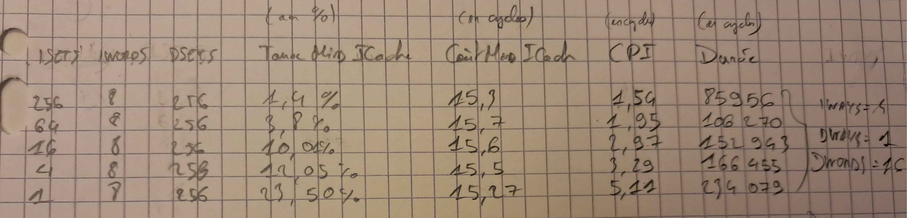
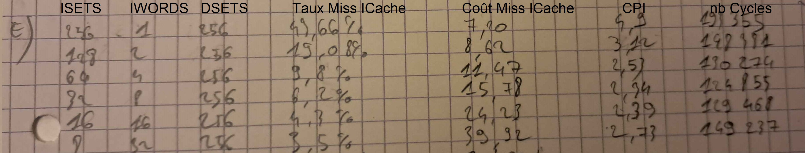
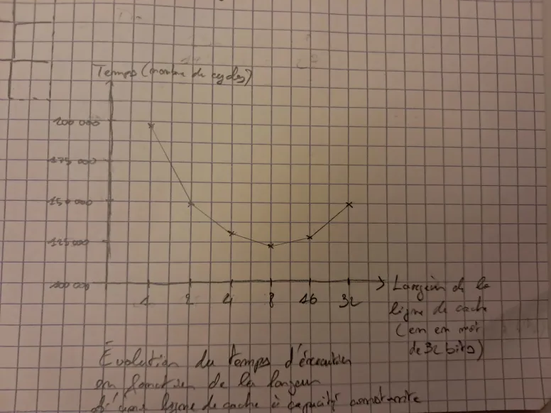
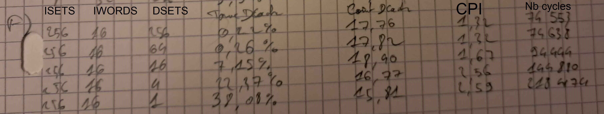

# Compte-rendu TP4

## C - Système mémoire presque parfait

On termine la simulation en '224802' cycles avec 8 sets, un degré 1 d'associativité, 4 mots par ligne de cache et un buffer de 8 mots de 32 bits.

### C1
Pour 256 sets, 16 mots par ligne, 4 niveau d'associativité et un tampon d'écriture postées de profondeur de 8 mots de 32 bits la simulation termine en '74502' cycles.
Avec un cache plus grand, un degré d'associativité plus grand et un nombre de famille beaucoup plus grands, la simulation met 3 fois plus de temps à terminer.

### C2
*** proc at cycle 74502
- INSTRUCTIONS       = 56510
- CPI                = 1.31839
- CACHED READ RATE   = 0.26889
- UNCACHED READ RATE = 0.0074677
- WRITE RATE         = 0.125465
- IMISS RATE         = 0.000619359
- DMISS RATE         = 0.00138203
- IMISS COST         = 24.4857
- DMISS COST         = 24.9048
- UNC COST           = 6
- WRITE COST         = 0

Taux de MISS du Cache d'instructions est de 0,062%.
Taux de MISS du Cache de données est de 0,138%.
Le CPI est de 1,318.

Pour l'évolution au cours du temps on analyse le résultat de cette commande: 
'./simul.x -NCYCLES 74502 -STATS 100'

- Cycle 19001:
ICACHE: 0.247%
DCACHE: 0.313%

- Cycle 47101:
ICACHE: 0.095%
DCACHE: 0.175%

Le taux de MISS baisse au fur et à mesure du temps.

Pour une analyse plus précise des 1000 premiers cycles:
- Cycle 100:
ICACHE: 20.0%
DCACHE: 50.0%

- Cycle 200:
ICACHE: 19.231%
DCACHE: 33.333%

- Cycle 300:
ICACHE: 14.035%
DCACHE: 15.385%

- Cycle 600:
ICACHE: 7.595%
DCACHE: 7.404%

- Cycle 1000:
ICACHE: 8.520%
DCACHE: 13.699%

Le taux de MISS baisse de manière significative lors des 1000 premiers cycles.

On peut interpréter que la diminution du taux de MISS est due aux accès mémoire (accès à tab[i]) qui sont de plus en plus espacés à cause de la fonction qui fait de plus en plus d'appels récursif (lorsque n augmente).

### C3
Une fonction 'transition' sur l'instance pibus_mips32_xcache est appelée et met à jour des attributs d'instrumentation pour mesurer le CPI et les taux de miss.
Le CPI est mesuré en divisant le compteur de cycles par le compteur d'instructions.
Les taux de MISS sont calculés en divisant le compteur de miss par le compteur d'instructions.

## D - Système mémoire presque parfait

### D1
On remarque dans le tableau ci-dessous que moins on a de familles différentes dans le cache d'instructions, plus on a un CPI et un taux de MISS élevé.
En effet, moins on a de familles, moi on a de capacité dans le cache donc on risque de faire plus de MISS.
Le coût lui ne change pas car lors d'un MISS, il dépend de la taille de donnée à récupérer qui reste fixe dans notre cas (16 words).

### D2
<!-- TODO -->

## E -

### E1
La configuration la plus efficace est celle avec une largeur de 8 mots de 32 bits.
Celà s'explique par le fait que plus on a de mots dans une ligne moins le taux de MISS est élevé, mais celà fait augmenter le coût car on a plus de données à transférer lors d'un MISS.
On trouve donc un juste milieu entre ces deux effets.
Il faut suffisamment de mots par ligne pour ne pas faire de MISS, mais pas trop non plus pour ne pas avoir un coût trop élevé.

## F - 

### F1

## G

### G1
Le tampon d'écritures postées est petite zone mémoire dans le cache, dans notre cas d'une largeur de 8 octets, qui permet d'enregistrer la donnée à écrire en mémoire lors d'une écriture afin de ne pas geler le processeur.

Lorsque le tampon d'écritures reçoit une requête alors qu'il est plein, le processeur attend qu'il vide au moins une place avant d'écrire dedans.

Lorsque le processeur fait une requête de lecture qui fait MISS et que le tampon d'écritures est non-vide, le processeur vérifie que la donnée ne se trouve pas dans le tampon pour assurer la cohérence dans le cas où celle-ci serait en cours d'écriture.

### G2

Profondeur  CPI     Coût    Taux       Temps
1 mot       4,87    0,46    15,36%     224908
2 mots      4,87    0.027   15,36%     224802
4 mots      4,87    0       15,36%     224802
8 mots      4,87    0       15,36%     224802

Le coût des écritures correspond au nombre de cycle que le processeur attend en moyenne lors d'une écriture.
Le coût des écritures est faible car le tampon d'écritures permet d'éviter les cycles de gel du porcesseur.
Ici, comme on augmente la taille du buffer, on a donc plus de place et la situation dans laquelle le buffer est plein et que le processeur doit attendre qu'une place se libère n'arrive plus.
Il suffit qu'il y ait au moins 1 place dans le tampon pour éviter d'attendre le temps nécessaire à l'écriture de la donnée.